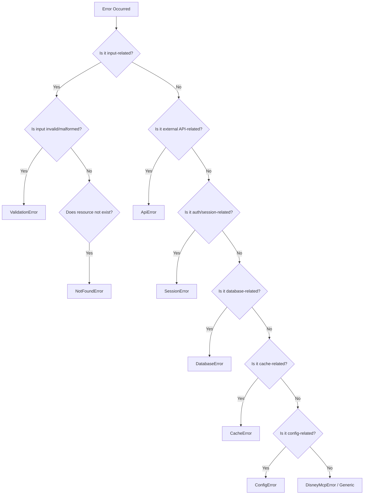

# Mouse MCP Error Type URIs

This document defines the error type URIs used in RFC 9457 Problem Details responses for the Mouse MCP server.

## Error Type URI Format

All error type URIs follow the pattern:

```
https://mouse-mcp.dev/errors/{error-type}
```

## Standard Error Types

### Generic Error

**URI**: `about:blank`

**Description**: A generic error occurred. This is the default error type when a more specific type is not applicable.

**Status Code**: 500 (Internal Server Error)

**When to Use**:

- Unknown error conditions
- Unexpected errors that don't fit other categories
- Fallback for unclassified errors

**Extensions**: None

**Example**:

```json
{
  "type": "about:blank",
  "title": "An error occurred",
  "status": 500,
  "detail": "An unexpected error occurred during processing",
  "instance": "urn:uuid:5c6d7e8f-9a0b-1c2d-3e4f-5a6b7c8d9e0f",
  "timestamp": "2025-12-06T18:37:00.000Z",
  "tool": "disney_sync"
}
```

---

### Validation Error

**URI**: `https://mouse-mcp.dev/errors/validation-error`

**Description**: Input validation failed. The request contained invalid, missing, or malformed data.

**Status Code**: 400 (Bad Request)

**When to Use**:

- Invalid parameter values
- Missing required parameters
- Schema validation failures
- Constraint violations (e.g., value out of range)
- Type mismatches

**Extensions**:

- `field` (string): Name of the field that failed validation
- `invalidValue` (unknown): Sanitized representation of the invalid value

**Example**:

```json
{
  "type": "https://mouse-mcp.dev/errors/validation-error",
  "title": "Validation Failed",
  "status": 400,
  "detail": "Invalid destination ID. Must be 'wdw' or 'dlr'",
  "instance": "urn:uuid:a3bb189e-8bf9-41c4-b5db-dbe0e0f51f6e",
  "timestamp": "2025-12-06T18:30:00.000Z",
  "tool": "disney_attractions",
  "field": "destination",
  "invalidValue": "orlando"
}
```

**Usage in Code**:

```typescript
throw new ValidationError(
  "Invalid destination ID. Must be 'wdw' or 'dlr'",
  "destination",
  args.destination,
  "disney_attractions"
);
```

---

### API Error

**URI**: `https://mouse-mcp.dev/errors/api-error`

**Description**: An external API request failed. This indicates a problem with an upstream service or third-party API.

**Status Codes**:

- 502 (Bad Gateway): Upstream API returned 4xx error
- 503 (Service Unavailable): Upstream API returned 5xx error

**When to Use**:

- Disney API request failures
- ThemeParks Wiki API failures
- Network errors to external services
- Timeout errors for external requests
- Rate limiting by external services

**Extensions**:

- `endpoint` (string): Sanitized API endpoint that failed (query parameters with sensitive data are redacted)

**Example**:

```json
{
  "type": "https://mouse-mcp.dev/errors/api-error",
  "title": "External API Error",
  "status": 503,
  "detail": "Disney API returned 503: Service temporarily unavailable",
  "instance": "urn:uuid:7c9e6679-7425-40de-944b-e07fc1f90ae7",
  "timestamp": "2025-12-06T18:31:15.000Z",
  "tool": "disney_attractions",
  "endpoint": "https://api.wdpro.disney.go.com/facility-service/attractions"
}
```

**Usage in Code**:

```typescript
throw new ApiError(
  "Disney API returned 503: Service temporarily unavailable",
  503,
  "https://api.wdpro.disney.go.com/facility-service/attractions",
  undefined,
  "disney_attractions"
);
```

---

### Session Error

**URI**: `https://mouse-mcp.dev/errors/session-error`

**Description**: Authentication or session management failed.

**Status Code**: 401 (Unauthorized)

**When to Use**:

- No valid Disney session available
- Session expired
- Authentication failed
- Session creation failed
- Browser automation session errors

**Extensions**: None

**Example**:

```json
{
  "type": "https://mouse-mcp.dev/errors/session-error",
  "title": "Session Error",
  "status": 401,
  "detail": "No valid Disney session. Session may have expired or authentication failed",
  "instance": "urn:uuid:3f7e4c8a-9d2b-4e3a-8f1c-2b5d9e6a7c8f",
  "timestamp": "2025-12-06T18:32:00.000Z",
  "tool": "disney_attractions"
}
```

**Usage in Code**:

```typescript
throw new SessionError(
  "No valid Disney session. Session may have expired or authentication failed",
  undefined,
  "disney_attractions"
);
```

---

### Not Found Error

**URI**: `https://mouse-mcp.dev/errors/not-found`

**Description**: The requested resource does not exist.

**Status Code**: 404 (Not Found)

**When to Use**:

- Attraction ID not found
- Destination ID not found
- Park ID not found
- Dining location not found
- Any entity lookup that returns no results

**Extensions**:

- `entityType` (string): Type of entity that was not found (e.g., "attraction", "destination", "dining")
- `entityId` (string): ID of the entity that was not found

**Example**:

```json
{
  "type": "https://mouse-mcp.dev/errors/not-found",
  "title": "Resource Not Found",
  "status": 404,
  "detail": "Attraction with ID '99999999' not found at Walt Disney World",
  "instance": "urn:uuid:1a2b3c4d-5e6f-7a8b-9c0d-1e2f3a4b5c6d",
  "timestamp": "2025-12-06T18:33:00.000Z",
  "tool": "disney_entity",
  "entityType": "attraction",
  "entityId": "99999999"
}
```

**Usage in Code**:

```typescript
throw new NotFoundError(
  "Attraction with ID '99999999' not found at Walt Disney World",
  "attraction",
  "99999999",
  "disney_entity"
);
```

---

### Database Error

**URI**: `https://mouse-mcp.dev/errors/database-error`

**Description**: A database operation failed.

**Status Code**: 500 (Internal Server Error)

**When to Use**:

- Database initialization failures
- SQL query errors
- Database connection failures
- Transaction failures
- Database file corruption

**Extensions**: None

**Example**:

```json
{
  "type": "https://mouse-mcp.dev/errors/database-error",
  "title": "Database Error",
  "status": 500,
  "detail": "Failed to initialize database: unable to open database file",
  "instance": "urn:uuid:8e7d6c5b-4a3f-2e1d-0c9b-8a7f6e5d4c3b",
  "timestamp": "2025-12-06T18:34:00.000Z"
}
```

**Usage in Code**:

```typescript
throw new DatabaseError(
  "Failed to initialize database: unable to open database file",
  { path: dbPath }
);
```

---

### Cache Error

**URI**: `https://mouse-mcp.dev/errors/cache-error`

**Description**: A cache operation failed. Cache errors are typically non-fatal and may result in fallback to the original data source.

**Status Code**: 500 (Internal Server Error)

**When to Use**:

- Cache read failures
- Cache write failures
- Cache corruption
- Cache initialization failures

**Extensions**: None

**Example**:

```json
{
  "type": "https://mouse-mcp.dev/errors/cache-error",
  "title": "Cache Error",
  "status": 500,
  "detail": "Failed to read from cache: cache file corrupted",
  "instance": "urn:uuid:2b3c4d5e-6f7a-8b9c-0d1e-2f3a4b5c6d7e",
  "timestamp": "2025-12-06T18:36:00.000Z"
}
```

**Usage in Code**:

```typescript
throw new CacheError(
  "Failed to read from cache: cache file corrupted",
  { cacheKey: key }
);
```

---

### Configuration Error

**URI**: `https://mouse-mcp.dev/errors/configuration-error`

**Description**: A configuration error occurred. This typically indicates missing or invalid environment variables, configuration files, or startup parameters.

**Status Code**: 500 (Internal Server Error)

**When to Use**:

- Missing required environment variables
- Invalid environment variable values
- Missing configuration files
- Invalid configuration file content
- Startup configuration errors

**Extensions**:

- `configKey` (string): Name of the configuration key that caused the error

**Example**:

```json
{
  "type": "https://mouse-mcp.dev/errors/configuration-error",
  "title": "Configuration Error",
  "status": 500,
  "detail": "Required environment variable MOUSEMCP_EMBEDDING_PROVIDER not set",
  "instance": "urn:uuid:9f8e7d6c-5b4a-3f2e-1d0c-9b8a7f6e5d4c",
  "timestamp": "2025-12-06T18:35:00.000Z",
  "configKey": "MOUSEMCP_EMBEDDING_PROVIDER"
}
```

**Usage in Code**:

```typescript
throw new ConfigError(
  "Required environment variable MOUSEMCP_EMBEDDING_PROVIDER not set",
  "MOUSEMCP_EMBEDDING_PROVIDER"
);
```

## Error Selection Guide

Use this flowchart to determine which error type to use:



## Error Hierarchy

```
DisneyMcpError (base)
├── ValidationError
├── ApiError
├── SessionError
├── NotFoundError
├── DatabaseError
├── CacheError
└── ConfigError
```

## HTTP Status Code Mapping

| Error Type | HTTP Status | Description |
|------------|-------------|-------------|
| ValidationError | 400 | Bad Request |
| SessionError | 401 | Unauthorized |
| NotFoundError | 404 | Not Found |
| ApiError (4xx) | 502 | Bad Gateway |
| ApiError (5xx) | 503 | Service Unavailable |
| DatabaseError | 500 | Internal Server Error |
| CacheError | 500 | Internal Server Error |
| ConfigError | 500 | Internal Server Error |
| DisneyMcpError | 500 | Internal Server Error |

## Best Practices

### DO

- Use the most specific error type available
- Include the tool name when throwing errors from tools
- Provide actionable detail messages that help users understand and resolve the issue
- Include entity context (entityType, entityId) when operating on specific entities
- Include field context for validation errors

### DO NOT

- Use generic DisneyMcpError when a specific type applies
- Include sensitive data in error details (tokens, passwords, full file paths)
- Change error titles between occurrences of the same type
- Use error types for conditions that aren't actually errors (e.g., empty results)

## Examples by Tool

### disney_attractions

```typescript
// Validation error
if (!["wdw", "dlr"].includes(args.destination)) {
  throw new ValidationError(
    "Invalid destination ID. Must be 'wdw' or 'dlr'",
    "destination",
    args.destination,
    "disney_attractions"
  );
}

// Session error
if (!session) {
  throw new SessionError(
    "No valid Disney session",
    undefined,
    "disney_attractions"
  );
}

// API error
if (!response.ok) {
  throw new ApiError(
    `Disney API returned ${response.status}`,
    response.status,
    endpoint,
    undefined,
    "disney_attractions"
  );
}
```

### disney_entity

```typescript
// Not found error
if (!entity) {
  throw new NotFoundError(
    `Entity with ID '${entityId}' not found`,
    entityType,
    entityId,
    "disney_entity"
  );
}
```

### disney_sync

```typescript
// Database error
try {
  await saveToDatabase(data);
} catch (error) {
  throw new DatabaseError(
    "Failed to save sync data to database",
    { error: (error as Error).message }
  );
}
```

## Security Considerations

All error responses are sanitized to prevent information leakage:

1. **File Paths**: Replaced with `[path]`
2. **Tokens/Keys**: Replaced with `[redacted]`
3. **Email Addresses**: Replaced with `[email]`
4. **Query Parameters**: Sensitive params (token, key, secret, password, auth) are redacted
5. **Large Values**: Truncated or summarized
6. **Objects/Arrays**: Summarized to prevent data leakage

## Migration from Legacy Errors

### Before (Legacy)

```typescript
return {
  content: [{
    type: "text",
    text: JSON.stringify({ error: message, code: "VALIDATION_ERROR" }, null, 2)
  }],
  isError: true
};
```

### After (RFC 9457)

```typescript
throw new ValidationError(
  "Invalid destination ID. Must be 'wdw' or 'dlr'",
  "destination",
  args.destination,
  "disney_attractions"
);

// Caught by tool handler and formatted as:
return formatErrorResponse(error, "disney_attractions");
```

## References

- [RFC 9457: Problem Details for HTTP APIs](https://www.rfc-editor.org/rfc/rfc9457.html)
- [Mouse MCP RFC 9457 Implementation](./rfc9457-problem-details.md)
- [IANA HTTP Problem Types Registry](https://www.iana.org/assignments/http-problem-types/)
