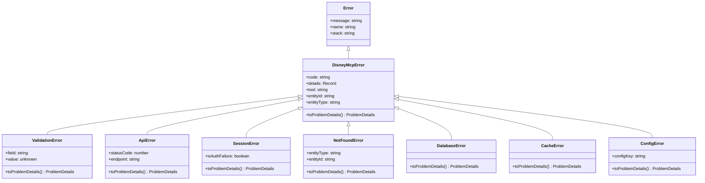

# RFC 9457 Problem Details - Architecture

Architecture diagrams and data flow for RFC 9457 Problem Details implementation in Mouse MCP.

## System Architecture


## Error Flow Diagram


## Error Class Hierarchy



## Problem Details Data Structure


## Error Type Selection Flow


## Sanitization Pipeline

```mermaid
graph LR
    A[Error Created] --> B[toProblemDetails]
    B --> C{Contains Sensitive Data?}

    C -->|File Paths| D[Replace with '[path]']
    C -->|Tokens/Keys| E[Replace with '[redacted]']
    C -->|Emails| F[Replace with '[email]']
    C -->|Query Params| G[Sanitize URL]
    C -->|Large Objects| H[Summarize '[Object]']
    C -->|Long Strings| I[Truncate '...']

    D --> J[Safe Problem Details]
    E --> J
    F --> J
    G --> J
    H --> J
    I --> J

    J --> K[formatErrorResponse]
    K --> L[MCP Response]
```

## Tool Handler Pattern


## Client Error Handling Flow


## Error Type Registry Lookup


## HTTP Status Code Mapping


## Component Interaction


## Data Flow: Validation Error Example


## Security Sanitization Flow

```mermaid
graph TD
    A[Error Data] --> B{Type of Data?}

    B -->|String| C{Content Check}
    C -->|Contains /path/| D[Replace with '[path]']
    C -->|Contains email| E[Replace with '[email]']
    C -->|Long token pattern| F[Replace with '[redacted]']
    C -->|Length > 100| G[Truncate to 97 chars + '...']
    C -->|Safe| H[Pass Through]

    B -->|URL| I{Has Query Params?}
    I -->|Yes| J{Sensitive Params?}
    J -->|token, key, secret, etc| K[Set to '[redacted]']
    J -->|No| L[Pass Through]
    I -->|No| L

    B -->|Object| M[Return '[Object]']
    B -->|Array| N[Return '[Array of N items]']
    B -->|Primitive| O[Pass Through]

    D --> P[Safe Value]
    E --> P
    F --> P
    G --> P
    H --> P
    K --> P
    L --> P
    M --> P
    N --> P
    O --> P
```

## Extension Fields by Error Type


## References

- [RFC 9457 Full Implementation](./rfc9457-problem-details.md)
- [Error Type URIs](./error-types.md)
- [Quick Reference](./rfc9457-quick-reference.md)
- [Examples](./rfc9457-examples.md)
