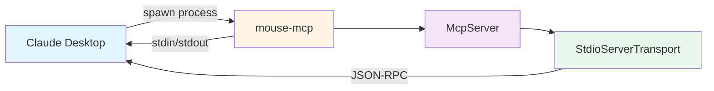
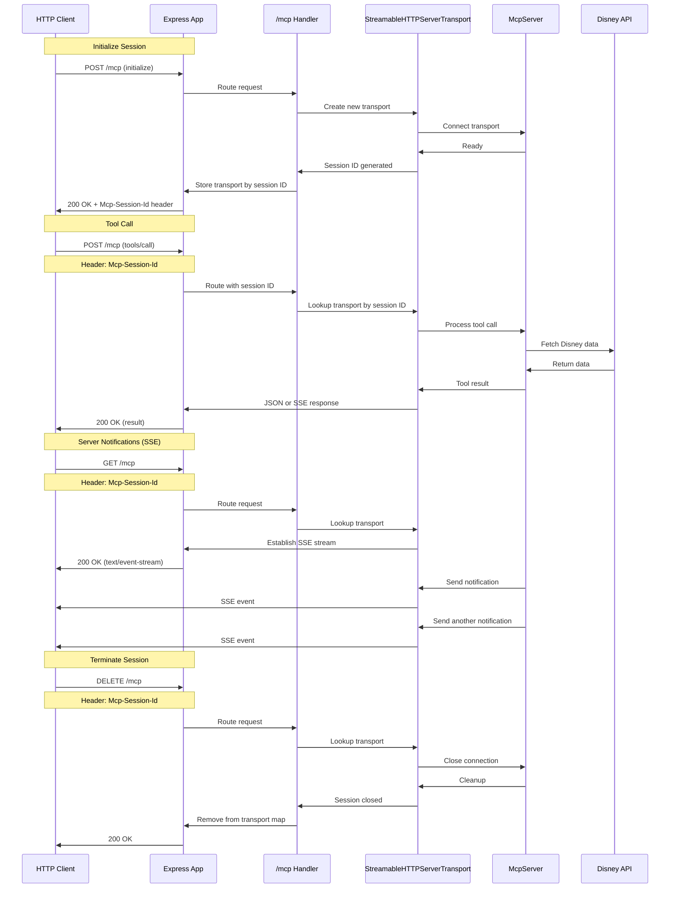
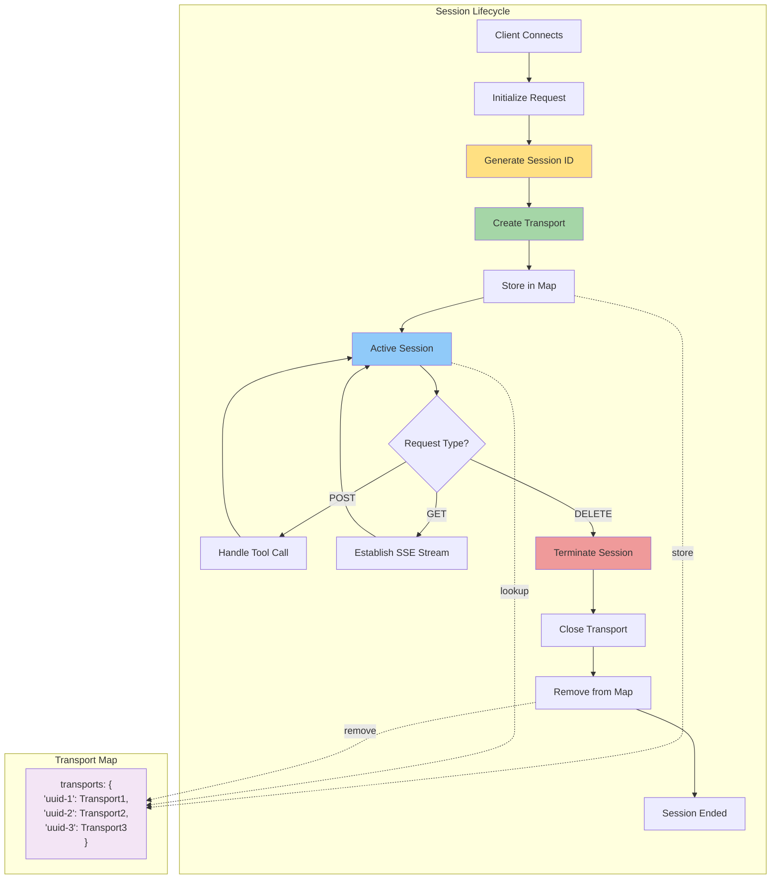
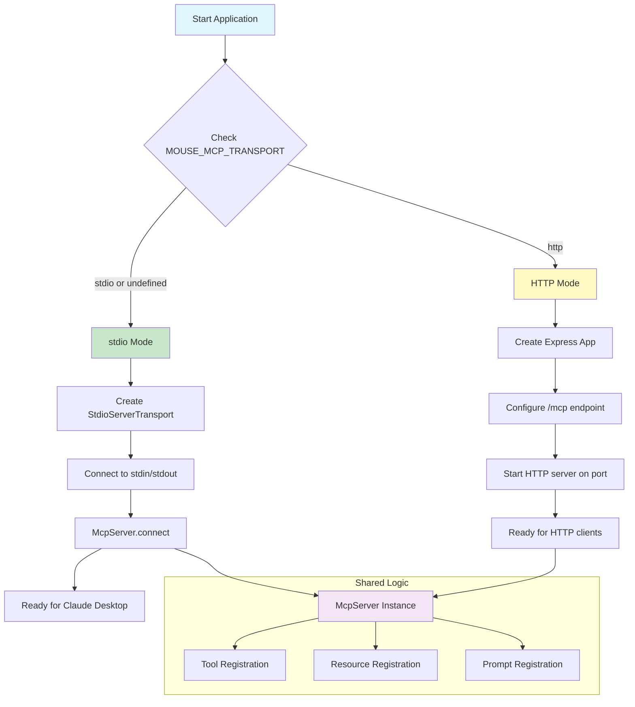
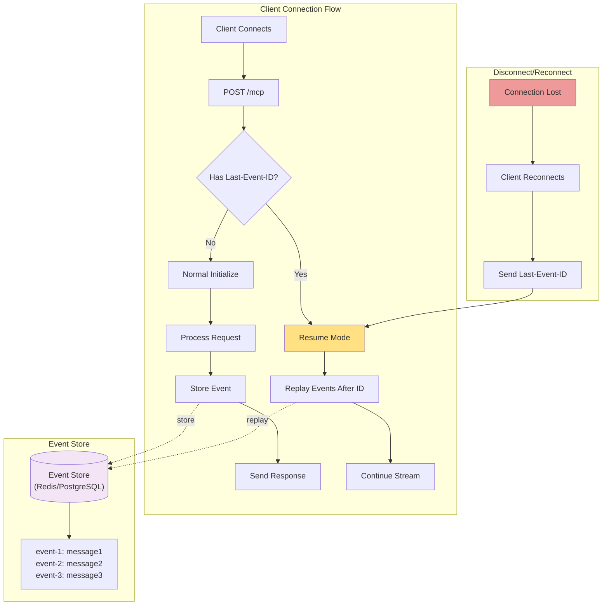
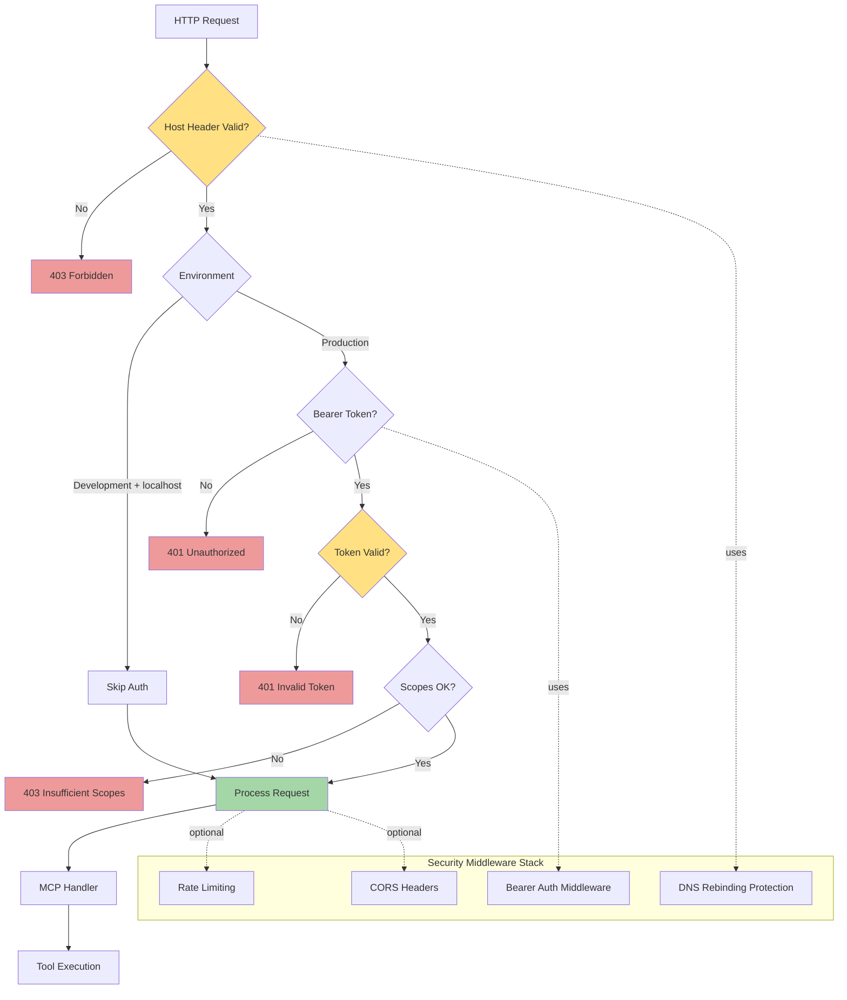
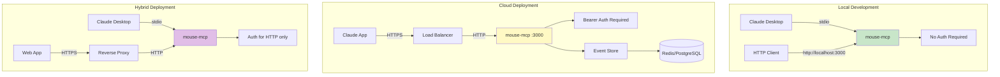

# HTTP Transport Architecture

Visual diagrams showing the architecture for adding HTTP transport to mouse-mcp.

## Current Architecture (stdio only)



## Dual Transport Architecture (stdio + HTTP)

```mermaid
graph TB
    subgraph "Local Mode"
        A1[Claude Desktop] -->|spawn subprocess| B1[mouse-mcp]
        B1 --> C1[McpServer Instance]
        C1 --> D1[StdioServerTransport]
        D1 -->|stdin/stdout JSON-RPC| A1
    end

    subgraph "HTTP Mode"
        A2[HTTP Client] -->|HTTP Request| B2[Express App :3000]
        B2 --> C2[/mcp Endpoint]
        C2 --> D2[StreamableHTTPServerTransport]
        D2 --> E2[McpServer Instance]
        D2 -->|SSE Stream| A2
    end

    subgraph "Shared Server Logic"
        S1[McpServer Class]
        S1 --> T1[Tool Handlers]
        S1 --> T2[Resource Handlers]
        S1 --> T3[Prompt Handlers]
    end

    C1 -.->|uses| S1
    E2 -.->|uses| S1

    style A1 fill:#e1f5ff
    style A2 fill:#e1f5ff
    style B1 fill:#fff4e6
    style B2 fill:#fff4e6
    style S1 fill:#f3e5f5
    style D1 fill:#e8f5e9
    style D2 fill:#e8f5e9
```

## HTTP Transport Request Flow



## Session Management



## Environment-Based Transport Selection



## HTTP Transport with Event Store (Resumability)



## Security Layers



## Deployment Scenarios



## File Structure After Implementation

```
mouse-mcp/
├── src/
│   ├── server.ts                  # DisneyMcpServer class
│   │   ├── runStdio()            # stdio transport method
│   │   └── runHttp()             # NEW: HTTP transport method
│   ├── index.ts                   # Entry point - transport selection
│   ├── config/
│   │   └── index.ts              # Config with transport settings
│   └── http/                     # NEW: HTTP-specific code
│       ├── server.ts             # HTTP server setup
│       ├── handlers.ts           # Request handlers
│       └── event-store.ts        # Event store implementation
├── .env.example                   # Updated with transport vars
└── docs/
    └── roadmap/
        ├── research-http-transport.md          # Full research
        ├── http-transport-quickstart.md        # Quick start
        └── http-transport-architecture.md      # This file
```

## Key Architecture Decisions

### 1. Single McpServer Instance
- Both transports use the same `McpServer` instance
- Tool/resource/prompt handlers are shared
- Only transport layer differs

### 2. Session Map Pattern
- Store transports by session ID
- Enables multiple concurrent HTTP connections
- Clean up on session close or timeout

### 3. Environment-Based Selection
- `MOUSE_MCP_TRANSPORT` env var controls mode
- Default to stdio for backwards compatibility
- No code changes needed to switch modes

### 4. Security by Default
- `createMcpExpressApp()` includes localhost protection
- Production MUST use authentication
- Development MAY skip auth for localhost only

### 5. Optional Resumability
- Event store is opt-in via configuration
- Start with in-memory for simplicity
- Migrate to persistent store (Redis/PostgreSQL) for production

## Next Steps

1. Review architecture diagrams
2. Identify which patterns to implement first
3. Create implementation plan
4. Begin with minimal HTTP support (Phase 1)
5. Add advanced features (resumability, auth) later
